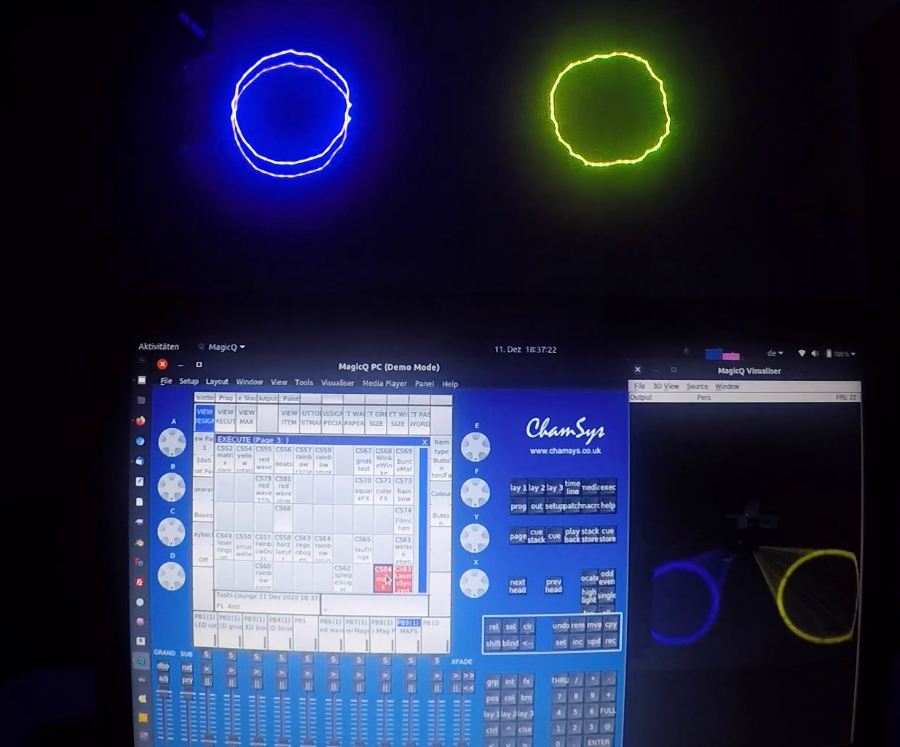

# dmxmapping - change values of dmx output like dimmercurves 
## dmx function for esp (ESP8266, ESP32) microcontrollers, that support SPIFFS

When working with dmx there are several reasons for adjusting the output values:
- change linearity of dimming
- if a device is too bright, just reduce brightness with mapping, but be able to use the full fader area
- make it possible to use animation features with you dmx controlled laser
- ...

## Why mapping is essential for dmx lasers
a typical description for dmx channels in a dmx laser documentation is:
- vertical movement `0..127` static, `128..255` automatic movements
- horizontal movement `0..127` ...

So you only have values from `0..127` to control movement.
If you control the movement of you laser, you will experience, that values `0 to 127` do not move from left to right.
`0` is normally in the middle, then `1..63` moves from the middle to the right, `64` is left and `64..127` moves from left to the middle.

If you want to control laser movement with the dmx software you need a translation like

| Translate from to    | L | M | R |
| -------------------- | --- |:---:| ---:|
| dmx controllers value | 0 ... | 127 128 | ... 255 |
| translated value to laser | 64 ... | 127   0 | ...  63 |


The same problems exist for rotation, zoom and maybe some other channels.

## Files for dmx mapping
You need a few map files to describe the translation of values:
```
*.map file - describes a translation
-------------------------------------------
Line1: new value for original value 0
Line2: new value for original value 1
...
Line256: new value for original value 255
Line257: ignored
...
```

As mapping is done in an array, that keeps all values, you can use only limited map-files due to limited memory depending on your RAM. Default are 20 mappings (`DMXMAP_MAX_MAPS` in `dmxmapping.h`) including default mapping, so 19 user mappings possible:  
`1.map, 2.map, 3.map ... 19.map`

`mappings.map` describes which dmx-channel uses which mapping
```
mappings.map
-------------------------------------------
<dmx-channel-no>,<map-file-no>
```

- dmx-channel-no: a value from 1 to 512
- map-file-no: a valid map-file-no from 1 to 19 (or 0 for default)

If a channel is not included in the `mappings.map`, it uses default mapping 0->0, 1->1, ... 255->255.

## Implementing dmxmapping in your code
At the moment dmxmapping exists for ESP8266 and you can choose between SPIFFS and LittleFS file system. Define `LITTLEFS` to use LittleFS.  
  
You have to either

``` cpp
#define MAPS
```

or change your `platformio.ini` like
```
  build_flags = ...
                -D MAPS
```

and 
``` cpp
#include <dmxmapping.h>
```

Further on - after filesystem is initialised - you have to init the arrays, read `mappings.map` and read the existing `*.map` files. 

``` cpp
void setup()
{
    ...

#ifdef LITTLEFS
  LittleFS.begin();
#else
  SPIFFS.begin();
#endif
    ...

    dmxMapsInit() ;
    chan2DmxMapsRead() ;
    dmxMapsRead();

    ...
}

    // after receiving data or somewhere in main loop)()
    dmxMapsExec(data, length);

```

For debugging `#define VERBOSE_MAP` somewhere or add `-D VERBOSE_MAP` to `build_flags` in `platformio.ini`.  
  
  
# dmxmapping in action  
  
Click the picture to watch the video.
[](http://lutzion.de/media/dmxmapping_with_2_lasers.mp4)  
  
  
# dmxmapping implemented  

my first an only implementation of dmxmapping so far is the project 
[ESP8266_Artnet_DMX_DC](https://github.com/Lutzion/ESP8266_Artnet_DMX_DC).  
